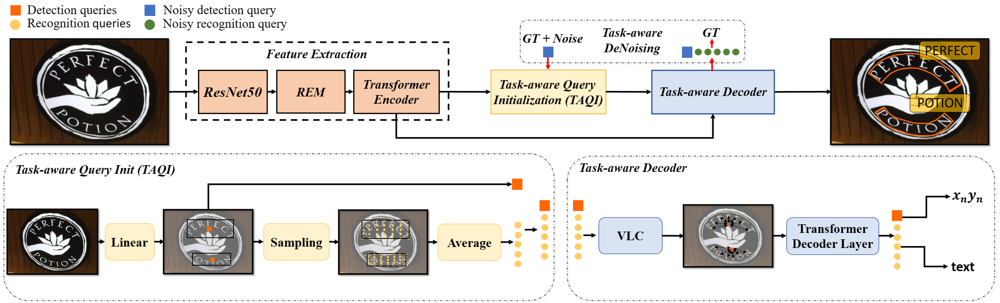
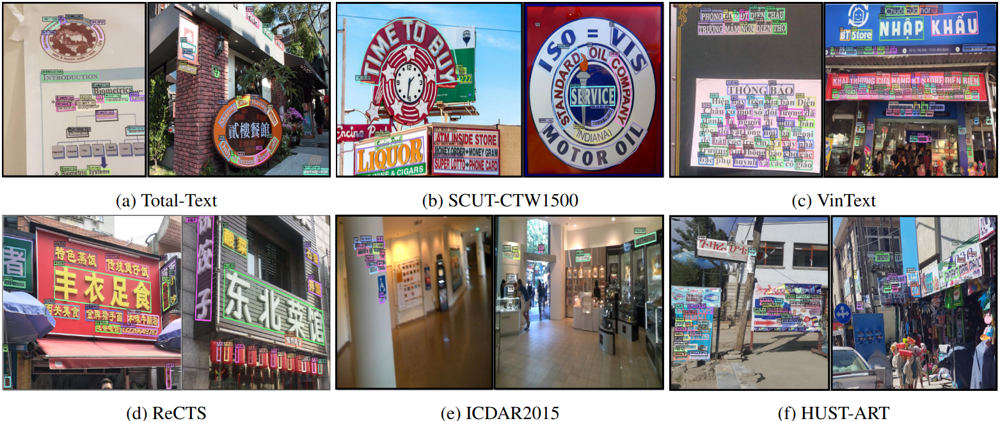

# ESTextSpotter: Towards Better Scene Text Spotting with Explicit Synergy in Transformer



This is the pytorch implementation of Paper: ESTextSpotter: Towards Better Scene Text Spotting with Explicit Synergy in Transformer (ICCV 2023). The paper is available at [this link](https://arxiv.org/pdf/2308.10147.pdf).

## News

`2023.07.21` Code is available. 

### Getting Started

- ### Installation
Python 3.8 + PyTorch 1.10.0 + CUDA 11.3 + torchvision=0.11.0 + Detectron2 (v0.2.1) + OpenCV for visualization
```shell
conda create -n ESTS python=3.8 -y
conda activate ESTS
conda install pytorch==1.10.0 torchvision==0.11.0 torchaudio==0.10.0 cudatoolkit=11.3 -c pytorch -c conda-forge
pip install -r requirements.txt
git clone https://github.com/mxin262/ESTextSpotter.git
cd detectron2-0.2.1
python setup.py build develop
pip install opencv-python
cd models/ests/ops
sh make.sh
```

### Data Preparation

Please download TotalText, CTW1500, MLT, ICDAR2013, ICDAR2015, and CurvedSynText150k according to the guide provided by SPTS v2: [README.md](https://github.com/bytedance/SPTSv2#dataset).

Extract all the datasets and make sure you organize them as follows

```
- datasets
  | - CTW1500
  |   | - annotations
  |   | - ctwtest_text_image
  |   | - ctwtrain_text_image
  | - totaltext (or icdar2015)
  |   | - test_images
  |   | - train_images
  |   | - test.json
  |   | - train.json
  | - mlt2017 (or syntext1, syntext2)
      | - annotations
      | - images
```

### Model Zoo

|Dataset|Det-P|Det-R|Det-F1|E2E-None|E2E-Full|Weights|
|:------:|:------:|:------:|:------:|:------:|:------:|:------:|
|**Pretrain**|90.7|85.3|87.9|73.8|85.5|[OneDrive](https://1drv.ms/u/s!AotJrudtBr-K70YeiNolNtP8B6h9?e=bLJdqg)|
|**Total-Text**|91.8|88.2|90.0|80.9|87.1|[OneDrive](https://1drv.ms/u/s!AotJrudtBr-K70OFqEm10zkcVtgF?e=hdkrOY)|
|**CTW1500**|91.3|88.6|89.9|65.0|83.9|[OneDrive](https://1drv.ms/u/s!AotJrudtBr-K70ThGHOrDR3NKf-9?e=kQdZWp)|

|Dataset|Det-P|Det-R|Det-F1|E2E-S|E2E-W|E2E-G|Weights|
|:------:|:------:|:------:|:------:|:------:|:------:|:------:|:------:|
|**ICDAR2015**|95.1|88|91.4|88.5|83.1|78.1|[OneDrive](https://1drv.ms/u/s!AotJrudtBr-K70WzBAGkh4JHk3br?e=ekbsBK)|

|Dataset|H-mean|Weights|
|:------:|:------:|:------:|
|**VinText**|73.6|[OneDrive](https://1drv.ms/u/s!AotJrudtBr-K70jc2mzjdm7XOuAF?e=pAIynN)|

|Dataset|Det-P|Det-R|Det-H|1-NED|Weights|
|:------:|:------:|:------:|:------:|:------:|:------:|
|**ICDAR 2019 ReCTS**|94.1|91.3|92.7|78.1|[OneDrive](https://1drv.ms/u/s!AotJrudtBr-K70dUc3W3ly1KI-zZ?e=ed6Drt)|

|Dataset|R|P|H|AP|Arabic|Latin|Chinese|Japanese|Korean|Bangla|Hindi|Weights|
|:------:|:------:|:------:|:------:|:------:|:------:|:------:|:------:|:------:|:------:|:------:|:------:|:------:|
|**MLT**|75.5|83.37|79.24|72.52|52.00|77.34|48.20|48.42|63.56|38.26|50.83|[OneDrive](https://1drv.ms/u/s!AotJrudtBr-K71EXnotwe2I7EI_W?e=F3Tkzo)|

### Training 
We use 8 GPUs for training and 2 images each GPU by default.
1. Pretrain
```
bash scripts/Pretrain.sh /path/to/your/dataset
```

2. Fine-tune model on the mixed real dataset

```
bash scripts/Joint_train.sh /path/to/your/dataset
```

3. Fine-tune model

```
bash scripts/TT_finetune.sh /path/to/your/dataset
```

### Evaluation 
0 for Text Detection; 1 for Text Spotting.
```
bash scripts/test.sh config/ESTS/ESTS_5scale_tt_finetune.py /path/to/your/dataset 1 /path/to/your/checkpoint /path/to/your/test dataset
```
e.g.:
```
bash scripts/test.sh config/ESTS/ESTS_5scale_tt_finetune.py ../datasets 1 totaltext_checkpoint.pth totaltext_val
```
### Visualization 
Visualize the detection and recognition results
```
python vis.py
```

## Example Results:



## Copyright
This repository can only be used for non-commercial research purpose.

For commercial use, please contact Prof. Lianwen Jin (eelwjin@scut.edu.cn).

Copyright 2023, [Deep Learning and Vision Computing Lab](http://www.dlvc-lab.net), South China University of Technology. 

## Acknowlegement
[AdelaiDet](https://github.com/aim-uofa/AdelaiDet), [DINO](https://github.com/IDEA-Research/DINO), [Detectron2](https://github.com/facebookresearch/detectron2), [TESTR](https://github.com/mlpc-ucsd/TESTR/tree/main)

## Citation

If our paper helps your research, please cite it in your publications:

```
@InProceedings{Huang_2023_ICCV,
    author    = {Huang, Mingxin and Zhang, Jiaxin and Peng, Dezhi and Lu, Hao and Huang, Can and Liu, Yuliang and Bai, Xiang and Jin, Lianwen},
    title     = {ESTextSpotter: Towards Better Scene Text Spotting with Explicit Synergy in Transformer},
    booktitle = {Proceedings of the IEEE/CVF International Conference on Computer Vision (ICCV)},
    month     = {October},
    year      = {2023},
    pages     = {19495-19505}
}
